# GA/TAS PULSE Builder's Guide

This guide provides step-by-step instructions for setting up GA/TAS.

> Note: that it would be confenient if you also have the status led connected.

**UNDER CONSTRUCTIONS**

## Use case: You want to receive additional traffic data via gatas Connect, you have your EFB running on your phone

### Connection diagram

```mermaid
flowchart TB
    GATAS -->|📶 Wi-Fi| HOTSPOT
    HOTSPOT -->|🌐 Cellular Data| GatasConnect

    GATAS --> |BLE| IPAD
    GATAS <--> |📡 868Mhz| Radio[FLARM/OGN/ADSL]


    GatasConnect[GA/TAS Connect]
    GatasConnect@{ shape: procs }

    HOTSPOT[📱Mobile Phone Hotspot<br />SkyDemon/ForeFlight/EasyVFR]
    HOTSPOT@{ shape: card }

    GATAS[🧠 GA/TAS]
    GATAS@{ shape: rounded}

    Radio[FLARM/OGN/ADSL]
    Radio@{ shape: cloud }

    IPAD[📱 iPad / EFB<br />SkyDemon]
    IPAD@{ shape: card }
```

> [!IMPORTANT]
> **Iphone Limitations**
> IPhones use connection isolation when used as a hotspot this means that unfortunately we cannot provide GDL90 data to an other device connected to the hotspot.
However, if the other device supports Bluetooth BLE, you can use that to provide NMEA data to your EFB, SkyDemon allows you to do this.

### Setup

- In GA/TAS under WIFI Service add your mobile phone's hotspot under *Client Configuration*.
- Enable gatasConnect module
- Configure gatas Connect with a pincode. 
  

> [!TIP]
In Additional to my phone's hotspot I also add ny hotspot at home so I can configure GA/TAS on my webbrowser of my computer. GA/TAS will try connnect to any available network in the list.
Once a connect drops, it will try other networks seemlessly.

## Use case: GA/TAS used as hotspot, mobile phone connects to GA/TAS

Connections:
 - DL90
 - BlueTooth
 - AirConnect

## Use case: Mobile router used as hotspot, GA/TAS connects to hotspot, Mobile Phone connects to hotspot.

Connections:
 - GDL90
 - BlueTooth

