# GA/TAS PULSE Builder's Guide

This guide provides step-by-step instructions for setting up GA/TAS.

!!! Tip
    It's highly recommended to also have the status Led connected, it will give you instal feedback on some of the basic state of GA/TAS.

## Use case 1: You want to receive additional traffic data via gatas Connect, you have your EFB running on your phone

```mermaid
flowchart TB
    GATAS -->|📶 Wi-Fi| HOTSPOT
    HOTSPOT -->|🌐 Cellular Data| GatasConnect

    GATAS --> |BLE| IPAD
    GATAS <--> |📡 868Mhz| Radio[fa:fa-tower-broadcast FLARM/OGN/ADSL ]


    GatasConnect[fa:fa-server GA/TAS Connect]
    GatasConnect@{ shape: procs }

    GATAS[fa:fa-microchip GA/TAS]
    GATAS@{ shape: rounded}

    Radio[fa:fa-tower-broadcast FLARM/OGN/ADSL]
    Radio@{ shape: cloud }
    IPAD[fa:fa-tablet-screen-button iPad / EFB<br />SkyDemon ]
    IPAD@{ shape: card }
```

### Setup

1) In GA/TAS under WIFI Service add your mobile phone's hotspot under *Client Configuration*.

!!! TIP
    In Additional to my phone's hotspot I also add my WIFI Network at home so I can configure GA/TAS on my webbrowser on my computer. Since GA/TAS will try connnect to any available network in the list. Once a connect drops, it will try other networks seemlessly. When I just drive away from home, it will connect to my hotspot.

2) Enable gatasConnect module

3) Configure gatas Connect with a pincode. 

!!! note
    **Iphone Limitations**
    IPhones use connection isolation when used as a hotspot this means that unfortunately we cannot provide GDL90 data to an other device connected to the hotspot.
    However, if the other device supports Bluetooth BLE, you can use that to provide NMEA data to your EFB, SkyDemon allows you to do this.

## Use case 2: GA/TAS used as hotspot, mobile phone connects to GA/TAS

```mermaid
flowchart TB
    HOTSPOT --> |📶 Wi-Fi| GATAS

    IPAD --> |WIFI| GATAS
    GATAS <--> |📡 868Mhz| Radio[fa:fa-tower-broadcast FLARM/OGN/ADSL ]

    HOTSPOT[fa:fa-mobile-screen-button Mobile Phone Hotspot<br />SkyDemon/ForeFlight/EasyVFR]
    HOTSPOT@{ shape: card}

    GATAS[fa:fa-microchip GA/TAS]
    GATAS@{ shape: rounded}

    Radio[fa:fa-tower-broadcast FLARM/OGN/ADSL]
    Radio@{ shape: cloud }
    IPAD[fa:fa-tablet-screen-button iPad / EFB<br />SkyDemon/ForeFlight/EasyVFR ]
    IPAD@{ shape: card }
```

1) Keep the GATAS Access Point with default SSID or configure a new name and password.

!!! warning
    **No Internet ADS-B**
    In this situation GA/TAS will not provide any internet traffic data for MLAT and ADSB-OUT

## Use case 3: Mobile router used as hotspot, GA/TAS connects to hotspot, Mobile Phone connects to hotspot.

```mermaid
flowchart TD
    MobileRouter --> GatasConnect
    GATAS <-->|📶 Wi-Fi| MobileRouter
    PHONE -->|🌐 Cellular Data| MobileRouter

    IPAD --> |BLE| GATAS
    IPAD2 --> |WIFI| MobileRouter
    GATAS <--> |📡 868Mhz| Radio[fa:fa-tower-broadcast FLARM/OGN/ADSL ]

    MobileRouter@{ shape: card}

    PHONE[fa:fa-mobile-screen-button Phone<br />SkyDemon/ForeFlight/EasyVFR]
    PHONE@{ shape: card}

    GATAS[fa:fa-microchip GA/TAS]
    GATAS@{ shape: rounded}

    Radio[fa:fa-tower-broadcast FLARM/OGN/ADSL]
    Radio@{ shape: cloud }
    IPAD[fa:fa-tablet-screen-button iPad<br />EFB<br />SkyDemon ]
    IPAD@{ shape: card }
    IPAD2[fa:fa-tablet-screen-button iPad<br />EFB<br />SkyDemon ]
    IPAD2@{ shape: card }
```

Setup is exactly as in **Use case 1**