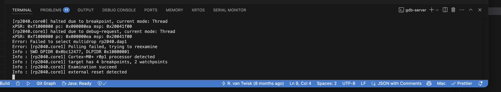

[](https://discord.gg/J6mXTcWndS)

This guide describes how to modify the GA/TAS codebase and create a new [UF2](https://github.com/microsoft/uf2) file for flashing onto the device.

For small changes or bug fixes, using the Docker container is often the easiest method. While compilation is slower and the resulting `gatas.uf2` file must be manually copied to your Pico, this approach requires only Docker and no other toolchain setup. The Docker build chain is daily tested [Github Action of GA/TAS](https://github.com/rvt/openace/actions)

> 🚨 Regardless of your build method, you must have the source repository cloned locally.

---

## Getting the Source

Clone the repository and initialize all submodules:

```bash
git clone --recurse-submodules https://github.com/rvt/openace
```

---

## Building with Docker

### Step 1: Build the Docker Image

From the `src` directory:

```bash
cd src
docker build -t openace-build-image .
```

### Step 2: Build the Firmware

Still within the `src` directory:

```bash
docker run --rm -e PICO_PLATFORM=rp2350 -e PICO_BOARD=pico2_w -e BUILDER_DIR_NAME=docker_release_rp2350 -v $(pwd):/opt/src --entrypoint /build-entrypoint.sh gatas-build-image-2.1.1-up
```


The first build may take a while, but subsequent builds will be significantly faster since Docker caches the build environment and reuses compiled modules. In addition only changed sourcesfiles will be compiled.
The resulting uf2 can be found in: `src/pico/release_build_docker/gatas.uf2`

---

## Setting Up a Native Development Environment (macOS)

> ⚠️ This setup has not been tested recently. Please report any issues you encounter.

### References

* [Getting Started with Raspberry Pi Pico (PDF)](https://datasheets.raspberrypi.com/pico/getting-started-with-pico.pdf)
* [Pico SDK Documentation](https://www.raspberrypi.com/documentation/pico-sdk/)
* [Programming the Pico on macOS](https://blog.smittytone.net/2021/02/02/program-raspberry-pi-pico-c-mac/)

### SDK Installation

Assume all installations are done in `/opt/pico`:

```bash
cd /opt/pico
git clone -b master --recurse-submodules https://github.com/raspberrypi/pico-sdk.git
```

Add to your shell profile (e.g., `.zshrc` or `.bash_profile`):

```bash
export PICO_SDK_PATH="/opt/pico/pico-sdk"
```

### FreeRTOS

```bash
cd /opt/pico
git clone -b master --recurse-submodules https://github.com/FreeRTOS/FreeRTOS-Kernel
```

Add to shell profile:

```bash
export FREERTOS_KERNEL_PATH="/opt/pico/FreeRTOS-Kernel"
```

### Toolchain

Do not use Homebrew. Instead:

* Download from [Arm GNU Toolchain](https://developer.arm.com/downloads/-/gnu-rm)
* Install to `/Applications/ARM`
* Update shell profile:

```bash
export PATH="/Applications/ARM/bin:$PATH"
export PICO_TOOLCHAIN_PATH="/Applications/ARM"
```

The Toolchain is daily tested in github: [Github Action of GA/TAS](https://github.com/rvt/openace/actions)


### Visual Studio Code Setup

1. Install [CMake Tools](https://marketplace.visualstudio.com/items?itemName=ms-vscode.cmake-tools) extension.
2. Open the `root` folder in VSC by using 'Add Folder To Workspace'
2. Open the `src/pico` folder in VSC 'Add Folder To Workspace'
3. Allow VSC to configure the project.
4. Choose the `GCC for arm-none-eabi` kit when asked

### Debugging with OpenOCD

* Install from [xPack OpenOCD Releases](https://github.com/xpack-dev-tools/openocd-xpack/releases)
* Avoid Homebrew versions

I installed it under: `/opt/pico/openocd`

### VSCode Launch Configuration

In `.vscode/launch.json`:

```json
{
  "name": "Pico Debug",
  "type": "cortex-debug",
  "request": "launch",
  "servertype": "openocd",
  "device": "RP2040",
  "cwd": "${workspaceRoot}",
  "executable": "${command:cmake.launchTargetPath}",
  "gdbPath": "arm-none-eabi-gdb",
  "configFiles": [
    "interface/cmsis-dap.cfg",
    "target/rp2040.cfg"
  ],
  "svdFile": "${env:PICO_SDK_PATH}/src/rp2040/hardware_regs/rp2040.svd",
  "runToEntryPoint": "",
  "showDevDebugOutput": "raw",
  "postRestartCommands": [
    "break main",
    "continue"
  ]
}
```

If you encounter adapter speed errors, add the following to `/opt/pico/openocd/openocd/scripts/target/rp2040.cfg`:

```bash
adapter speed 12000
```

---

## Opening the Project in VS Code

1. Launch a new VS Code window and open the root GA/TAS directory.
2. Use "Add Folder to Workspace" to include the `Pico` directory.

Your workspace should now contain the base and `Pico` folders.

Your screen should look like this:


---

## Debugging and Monitoring

To start a debug session:

* Click the debug icon in the left panel
* Select **Pico Debug** configuration
* Click the green play icon

If everything is set up correctly, GDB and OpenOCD will start, flash your firmware, and begin debugging.


To monitor GA/TAS output via serial:

```bash
minicom -D /dev/cu.usbmodem14102
```


Replace the device path as needed.

