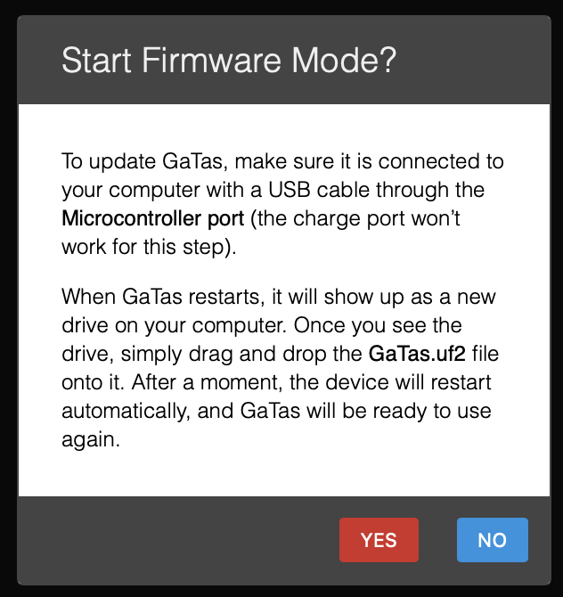

# First Time Firmware Installation Guide

This guide provides step-by-step instructions for installing firmware on a Raspberry Pico using the `gatas-rpxxxx.uf2` file.

---

## Step-by-Step Instructions

### 1. Download the Firmware File
- Visit the [GA/TAS Releases page](https://github.com/rvt/OpenAce/releases) to download the appropriate firmware file (`gatas-rpxxxx.uf2`).
- Ensure you download the correct version for your Raspberry Pico model:
  - **RP2040** or **RP2350**.

### 2. Set GA/TAS in boot mode via the UI
1. In the UI on the 'aircraft' page select the button [Update/Upload Firmware]
2. Confirm the pop-up dialog with [YES]

{width=320}

### 3. Access USB Mass Storage Mode
- The Pico will appear as a **USB mass storage device** on your computer:
  - On **Windows**, it will appear as a removable drive.
  - On **macOS** and **Linux**, it will appear as an external drive labeled `RPI-RP2`.

### 4. Flash the Firmware
1. Open the `RPI-RP2` drive on your computer.
2. **Drag and drop** or **copy and paste** the `gatas-rpxxxx.uf2` file into the Pico's drive.
   - Do **not** attempt to open or modify the `.uf2` file.

### 5. Automatic Reboot
- Once the file is copied, the Pico will **automatically reboot** and begin running the new firmware.
- The Pico will disappear from your list of drives, indicating the flashing process is complete.

### 6. Verify Installation
- After rebooting, the Pico will start running the newly installed firmware.
- A **green LED** on the Pico will flash once per second, confirming successful installation.

---

---

## Summary of Steps
1. Download the `gatas-rpxxxx.uf2` file from the [GA/TAS Releases page](https://github.com/rvt/OpenAce/releases).
2. Set GA/TAS in boot mode via the UI
3. Release the BOOTSEL button once connected.
4. Copy the `gatas-rpxxxx.uf2` file to the Pico's mass storage drive.
5. The Pico will reboot automatically and run the new firmware.
6. Verify the installation by checking the green flashing LED.

---

For additional support, join the [GA/TAS Discord Community](https://discord.gg/J6mXTcWndS).