# GA/TAS PULSE Builder's Guide

GA/TAS Pulse is an easy to build with standard component version that has all the capabilities of GA/TAS,
except it only uses one Tranceiver (SX1262) instead of two. It will still send and receive all the protocols and when a specific protocol is received, it will prioritice listing to protocols it receives. With a build in charger and a battery lifetime of around 20Hours it is the ideal no worries comopanion Traffic Awareness system.

> ⚠️ The case and design are under constant refinement so it can be that the case is slightly different than shown in the pictures. However, the pins and schematic will always be correct.

## Overview

This document provides step-by-step instructions to:

- Solder the necessary header pins onto the Pico.  
- 3D print and assemble a protective case for the device.
- Flash the GA/TAS firmware onto a Raspberryco.
- Final soldering of charger, battery and switch

## Prerequisites

- **Hardware:**

| Item                   | No Items                                        | Link                                                                                                                                                                       | Price  | Image                                                         |
| :--------------------- | :---------------------------------------------- | :------------------------------------------------------------------------------------------------------------------------------------------------------------------------- | :----- | :------------------------------------------------------------ |
| **RP2350 W**           | 1 Get headers soldered if unsure. | [TinyTronics](https://www.tinytronics.nl/nl/development-boards/microcontroller-boards/met-wi-fi/raspberry-pi-pico-2w-rp2350)                                               | €9.25  | 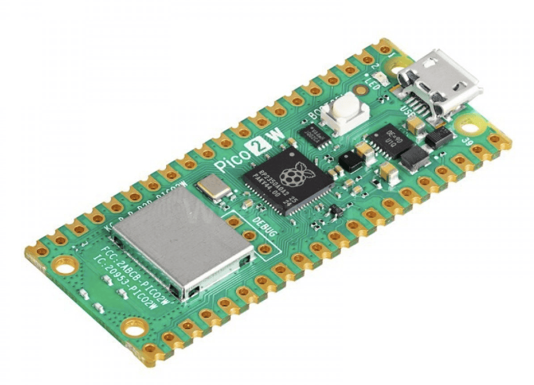 { width="100" }  |
| **40Pin header male**  | 1 To solder on RP2350             | [TinyTronics](https://www.tinytronics.nl/nl/kabels-en-connectoren/connectoren/pin-headers/male/40-pins-header-male)                                                        | €0.40  | 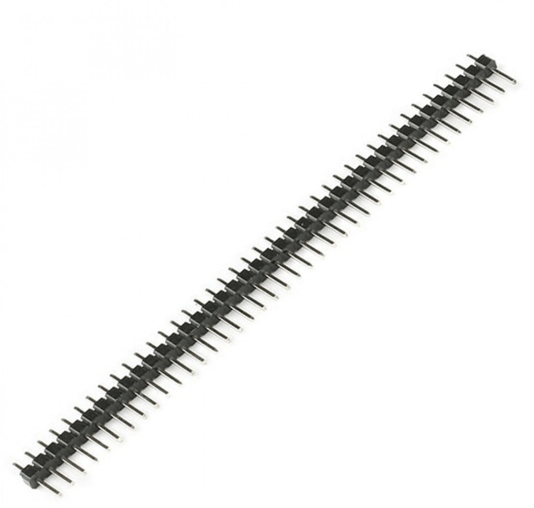{ width="100" } |
| **Waveshare L76B GPS** | 1 Includes antenna                | [TinyTronics](https://www.tinytronics.nl/nl/communicatie-en-signalen/draadloos/gps/modules/waveshare-l76b-gnss-module-voor-raspberry-pi-pico)                              | €16.50 | 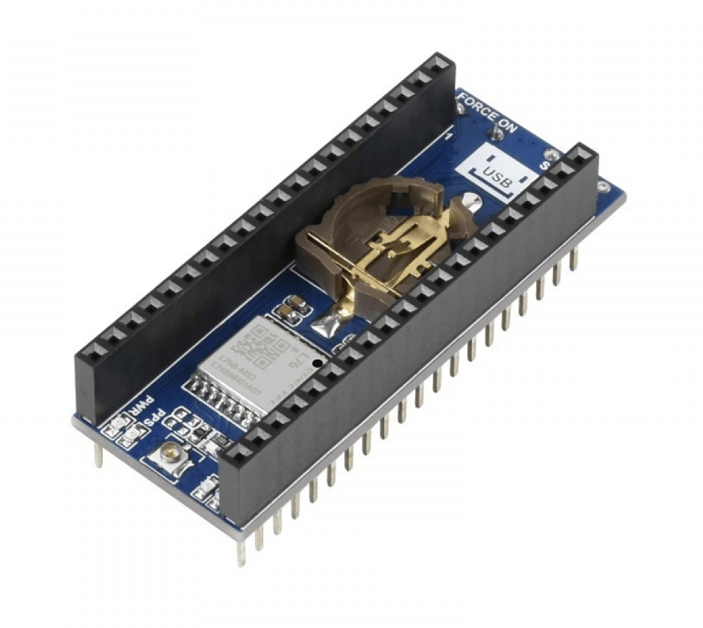                |
| **Waveshare SX1262**   | 1                                               | [TinyTronics](https://www.tinytronics.nl/nl/communicatie-en-signalen/draadloos/lora/waveshare-sx1262-lora-node-module-voor-raspberry-pi-pico)                              | €15.00 | 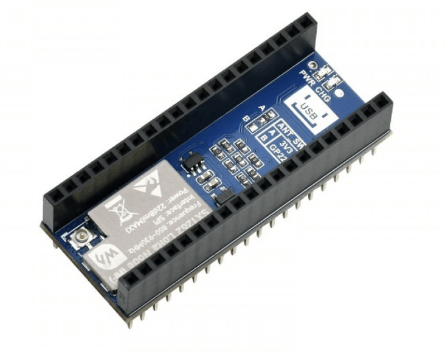                |
| **TP4056 Charger**     | 1                                               | [TinyTronics](https://www.tinytronics.nl/en/power/bms-and-chargers/li-ion-and-li-po/with-protection-circuit/tp4056-usb-c-li-ion-charger-1a-with-li-ion-protection-circuit) | €2.50  |                 |
| **18650 Battery**      | 1                                               | [TinyTronics](https://www.tinytronics.nl/nl/power/batterijen/18650/sanyo-18650-li-ion-batterij-3350mah-10a-ncr18650ga)                                                     | €7.00  | 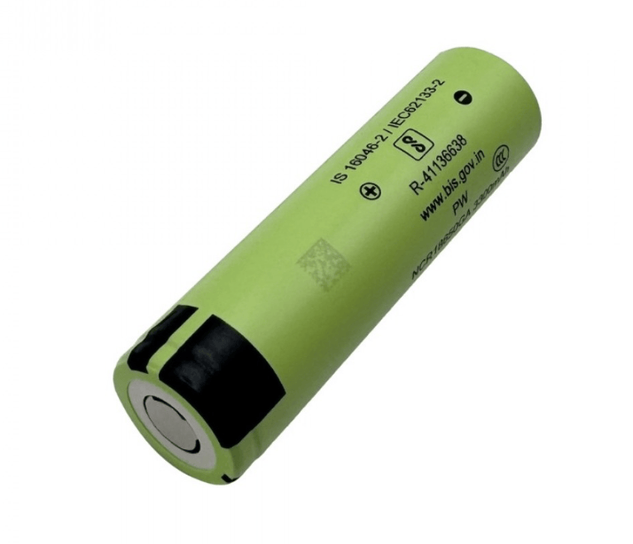                |
| **18650 Holder**       | 1                                               | [TinyTronics](https://www.tinytronics.nl/nl/power/batterijhouders-en-clips/18650/1x-18650-batterijhouder-met-losse-draden-button-top)                                      | €2.50  | 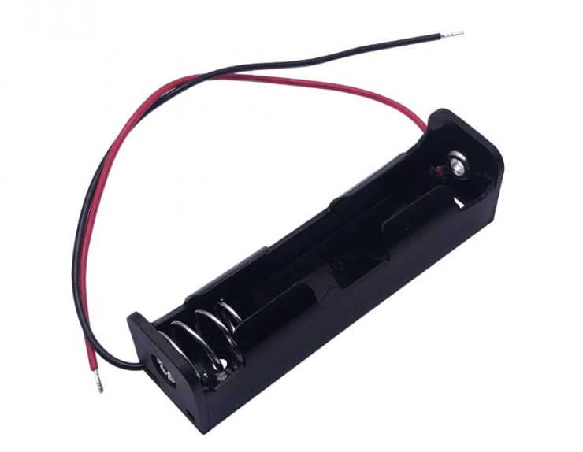                |
| **Switch**             | 1                                               | [TinyTronics](https://www.tinytronics.nl/en/switches/manual-switches/toggle-switches/standard-built-in-flip-switch-mts-102)                                                | €0.60  | 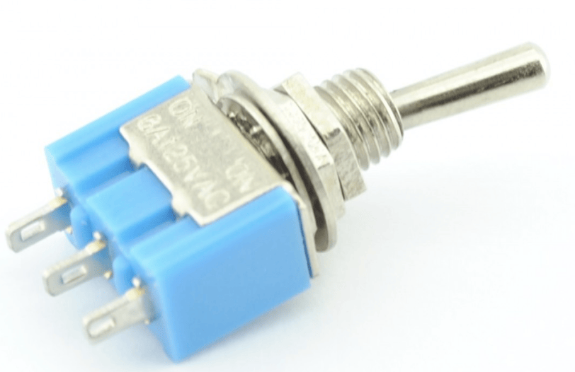                |
| **SMA Antenna**        | 1                                               | [Amazon](https://www.amazon.nl/Eightwood-Antenne-Connector-Draadloze-Homematic/dp/B072BMBXMH/ref=asc_df_B072BMBXMH)                                                        | €11.00 | 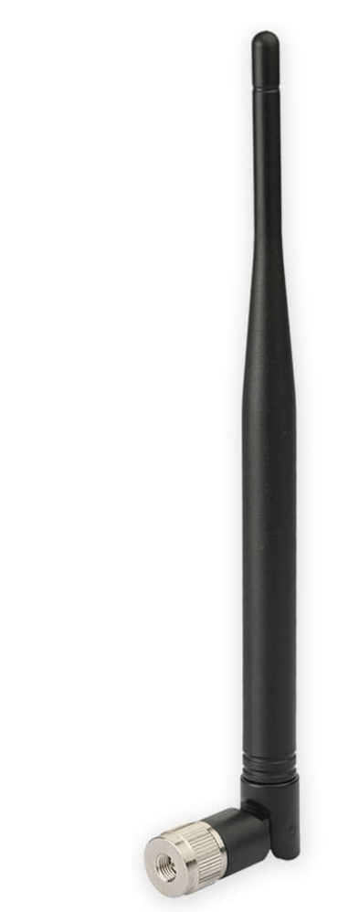                |
| **Suction Cup Mount**  | 1 Optional                        | [Amazon](https://www.amazon.nl/-/en/dp/B07B9V3YJD?ref=ppx_yo2ov_dt_b_fed_asin_title)                                                                                       | €11.00 | 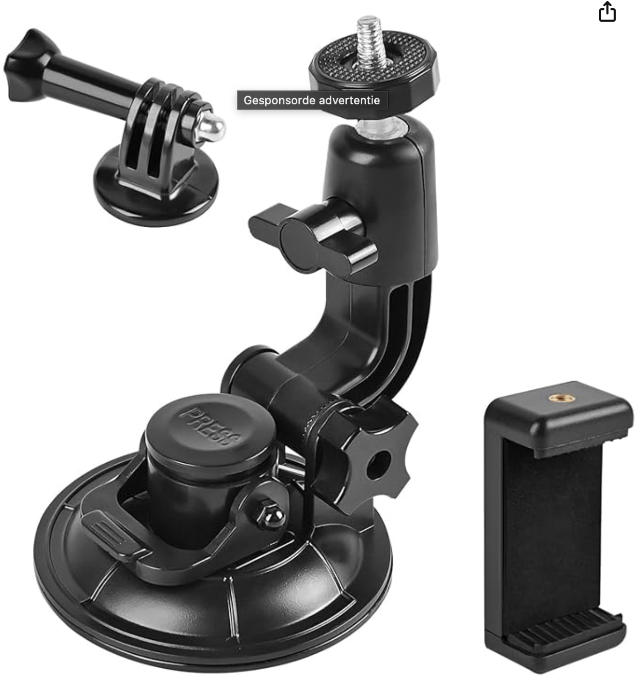                |
| **Terminal Block**     | 1 Optional                        | [Aliexpress](https://www.aliexpress.com/item/1005008048030314.html)                                                                                                        | €2.00  | 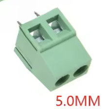                      |
| **GPS Antenna**        | 1 Better alternative              | [Aliexpress](https://www.aliexpress.com/item/1005008929041250.html)                                                                                                        | €9.00  |                |
| **M2.5 Bolt**          | 8                                               | [Aliexpress](https://www.aliexpress.com/item/1005004174685955.html)                                                                                                        | €4.00  |                       |

> ⚠️ If you still have an RP2040 with Wi-Fi laying around, feel free to use that. There is nothing on the RP2350 that is strictly required as of now. You can always swap the RP2040 with an RP2350 later if needed.

_Assorted items you might already have, or a friend has:_

- Micro-USB cable for connecting the Pico to your computer for flashing
- Heat shrink tubing, about 4mm diameter
- Soldering iron with a fine tip
- Lead-free solder
- Soldering stand and sponge or brass tip cleaner
- Wire cutters or snips
- Soldering jig (optional, for stability during soldering)
- Some small wires
- LEd (Yellow) + 220Ohm resistor , Optionally
- Antistatic foam (you can use the foam your components came in)
- 3D printer + about 30m of filament (85 grams) of PET-G or similar material that handles higher temperatures better, as this device is often found near a window in the sun.

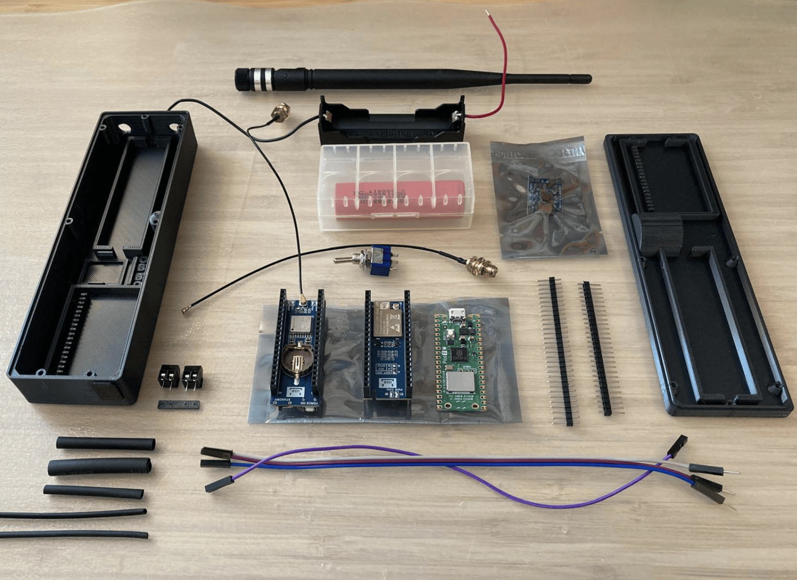

---

## Step 1: Download and Install the Firmware

Use this document: [Firmware Installation](Firmware-Install.md)

---

## Step 2: 3D Print the Protective Case

### 2.1: Obtain the Case Design Files

1. Visit the [GA/TAS GitHub Repository](https://github.com/rvt/openace).
2. Navigate to the `enclosure/gatas` directory to find the `.stl` files for the case design.
3. Download the necessary `.stl` files to your computer.

The design is created in OpenSCAD, and the filename of this project is `gatas_pulse.scad`. The file has some options if needed. If you have any good ideas, let me know!

### 2.2: Prepare for Printing

1. Open your preferred 3D printing slicer software (e.g., Cura, PrusaSlicer, BambuStudio).
2. Import the downloaded `.stl` files into the slicer.
3. Configure the print settings:

   - **Material:** PLA or PET-G (PET-G is preferred for temperature stability)
   - **Layer Height:** 0.2 mm
   - **Infill Density:** 50%
   - **Supports:** Enable if the design has overhangs

> **Note:** Ensure that your printer's build volume accommodates the size of the case.

### 2.3: Print the Case

1. Save the sliced file to your printer's SD card or send it directly to the printer if connected.
2. Start the printing process.
3. Once printing is complete, carefully remove the parts from the build plate.
4. Clean up the print if required.

---

## Step 4: Solder the Header Pins and Charger

Soldering header pins onto the Raspberry Pico allows for secure connections to other components and ensures proper alignment within the protective case.

### 4.1: Gather Materials

- Raspberry Pico
- 2 × 20-pin male header pins
- Soldering iron with a fine tip
- Lead-free solder
- Soldering stand and sponge or brass tip cleaner
- Wire cutters or snips
- Breadboard or soldering jig (optional)
- TP4056 Charger board

### 4.2: Insert the Header Pins

I don't have a breadboard, but my way of working is to cut the number of pins and solder one corner first, then validate if the pins are perfectly straight. If not, I straighten them out first. Make sure this work is done perfectly—the pins should be at a perfect 90-degree angle.

> **Note:** If you have a breadboard, you can use it as a rig for perfectly straight solder work.

Once confirmed aligned, solder the rest of the pins.

|                                                        |                                                         |
| ------------------------------------------------------ | ------------------------------------------------------- |
|   | 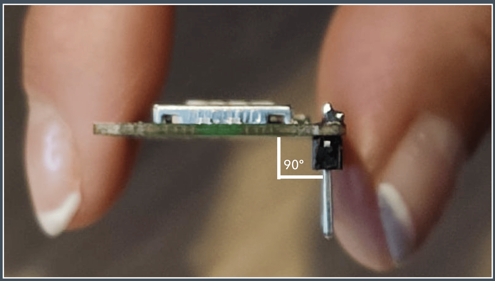 |
|  |                                                         |

### 4.4: Inspect the Solder Joints

- Ensure that each solder joint is shiny and has a volcano-like shape.
- Check for any solder bridges (unwanted connections between adjacent pins) and rework if necessary.

### 4.5: Solder Terminal Blocks on the Charger Board (Optional but Recommended)

Use the small plastic with the 4 points as a support for the two terminal blocks.

- Ensure that each solder joint is shiny and has a volcano-like shape.

|                                                       |                                                       |
| ----------------------------------------------------- | ----------------------------------------------------- |
| 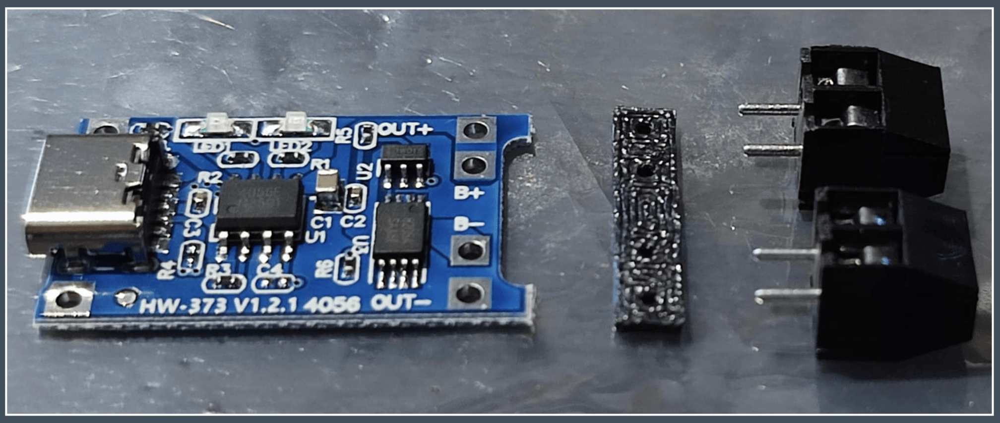 | 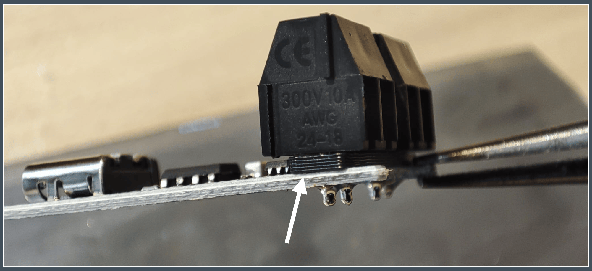 |

---

## Step 6: Final Assembly and Soldering

### Step 6.1: Assemble the Case

1. Insert the GPS + 868MHz Chassis Panel Mount into the case.
2. Insert the toggle switch into the lid and tighten securely.
3. Carefully insert the charger into the clips.
4. Carefully assemble the Pico + GPS + SX1262 (in that order) on top of each other. Each module clearly shows the direction of the USB connector. Ensure they are stacked correctly.
5. Put the battery charger in place, but do not insert the battery yet.

|                                                                                                                                 |                                                        |
| ------------------------------------------------------------------------------------------------------------------------------- | ------------------------------------------------------ |
| 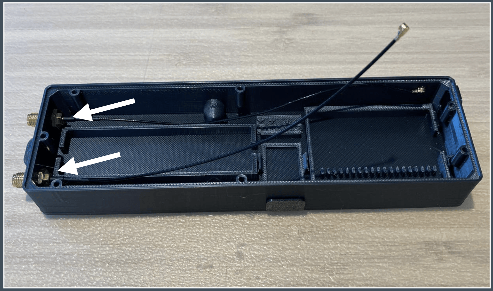                                                                           |  |
| 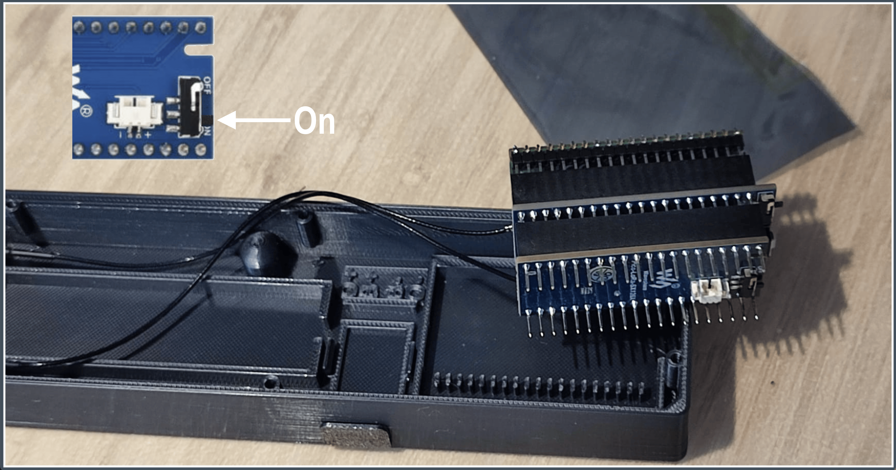 Ensure both GPS and LoRaWAN module switches are set to ON. |  |
| 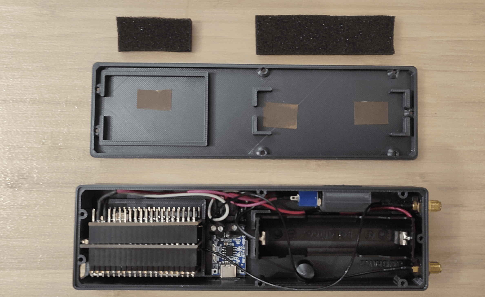                                                                          |   |

### Step 6.2: Schematic

Observe the schematic below carefully. It's designed so you can charge the battery while the device is on or off.

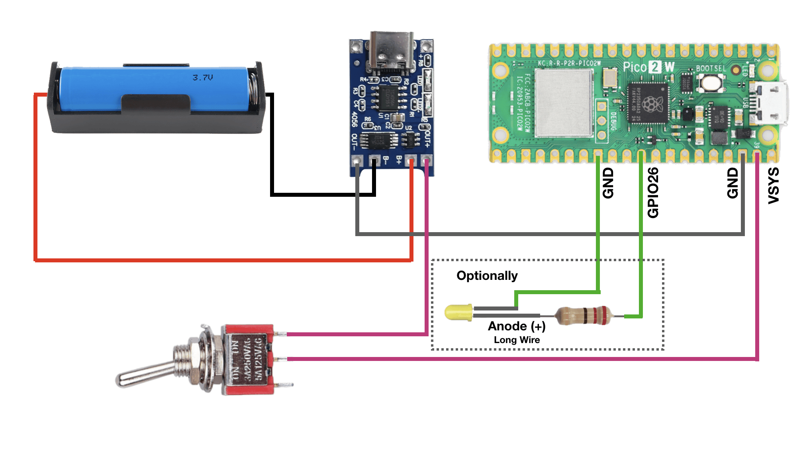  

### Step 6.3: Soldering the Power Wires

There are a few wires that need soldering, including the switch. Some wires might need to be extended. Ensure that each wire is soldered neatly and loosely to allow easy assembly and disassembly later. This also helps handle vibrations better.

### Step 6.4: Optionally solder PPS

If you want tighter timing for both receiving and transmitting of radio frames (recommended), you can solder the PPS R0 pad on the L76B module. You can just put a tiny solder blob.
Be warned: it’s a tiny pad, and most people won’t want to attempt it. Honestly, it’s a mystery why Waveshare didn’t just add a little switch for this.
When you did solder it, do not forget to disable *'Software Based PPS'* in the Configuration of the L76B GPS.

Once GPS lock is acquired, both the led of the GPS (red) and Raspberry PICO (Green) should blink in sync. 

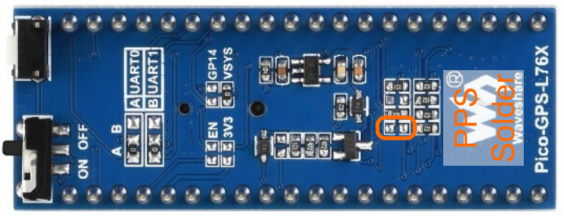  

---

## Additional Resources

### Final Notices:

- Work slowly and double-check everything. I have never broken a device myself, even when I swapped a wire, but it's better to be safe than sorry.
- When storing the device for a long period, the battery should be charged to 60–80%. Ideally, it should never be stored with an empty battery.

- [GA/TAS GitHub Repository](https://github.com/rvt/openace): Access source code, documentation, and updates.
- [Raspberry Pi Pico Documentation](https://www.raspberrypi.com/documentation/microcontrollers/): Learn more about the Pico's features and capabilities.

---

If you require further assistance or have specific questions about the GA/TAS PULSE firmware, soldering process, or case design, please refer to the project's GitHub repository or contact the maintainers directly on [Discord](https://discord.gg/J6mXTcWndS)

---
